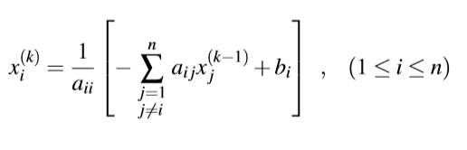
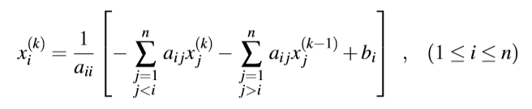

The chapter 3 regards numerical methods to solve systems of linear equations.
# Gaussian Elimination
The Gauss-Jordan method consists in transforming a matrix till the elements on the main diagonal, aii, be equal to 1, and all the remaining elements be equal to zero (identity matrix). 

* Iterate through all matrix lines.
    * Divide all elements of the current line, **Li**, by the element of the main diagonal for that line, **aii**. If we are on the second line, we divide its elements by the element on the second row, second collumn, a22. That element, **aii**, becomes 1.
    * Next, we need to make the elements above and below **aii** equal to zero. We achieve that with subtract/addition operations over line.
        * Iterate through all the lines, **Lj**, different from **Li**. Apply **Lj = Lj - aji*Li**

A more detailed explanation can be found on [Wikipedia](https://en.wikipedia.org/wiki/Gaussian_elimination).

[Implementation in C language](Gaussian%20elimination.c)

## Error
### Internal and external stability
There are two types of erros in Gauss method. 
* Internal stability : This is due calculation process, such rounding and truncation.
* External stability : erros in the data such coeficients and independent terms.

#### External stability
Consider the system of linear equations represented in matrix form, Ax=b, with N equations, so A has NxN dimensions, x has Nx1 dimensions and b has Nx1 dimmesions. 
If we know that matrix A (containg the terms coeficients) has some error  and matrix b has some error , we are interested in determine the error , which is the error that affects the solution of the system.

Solving the above system shows how the solutions are affected. 
 is a NxN matrix, filled with the error that affects A and  is a Nx1 matrix filled with the error that affects B.
 represents the system solution.

#### Internal stability 

# Iterative Methods
There are two iterative methods based on Picard-Peano method seen on Chapter 2. Iterative methods tend to diverge in most cases, so there's a convergence condition for both methods listed below. Representing a system of linear equations in matricial form, Ax=b, we need to ensure for every line in A, the element aii has an absolute value (main diagonal) higher than the sum of the remaining elements, aij, absolute value.

For example, the system below doesn't ensure the iterative methods will converge to the solution.

The matrix lines would need to be re-arranged as follows.

An easy way to do it, is to look at the first collumn and find the line that has the largest number. That must be the first line of the matrix. The line that has the largest number on the second collumn, must be the second line of matrix, and so on.

To apply the iterative methods, just like we did on Picard-Peano, for each variable we write an equation that depends on the other variables and constant terms. For instance, for the system above, assume the variables x, y, z and w. Then we would write x in function of (y,z,w), y in function of (x,z,w) and so on.

The methods just change how x(n+1) is calculated from xn.

## Gauss-Jacobi

## Gauss-Seidel
   