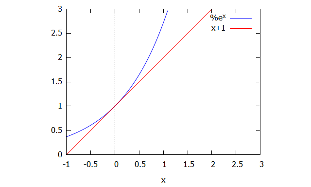
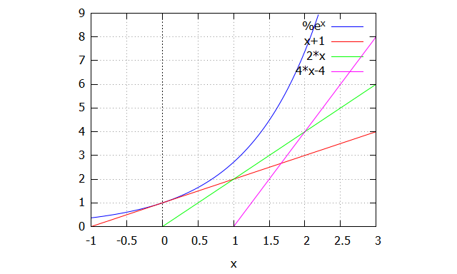
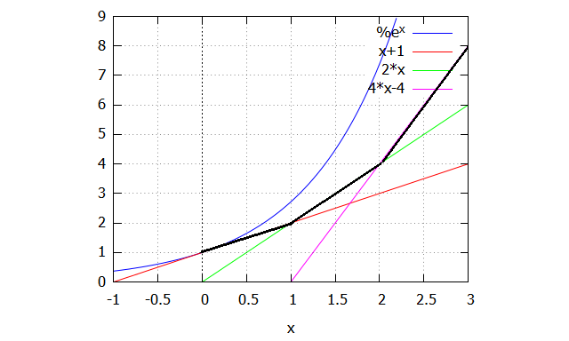

This regards the Chapter 5, about solving differential equations using numerical methods.

# First Order Diferential Equations
## Euler's Method
The Euler method is the most simple method to solve ODEs. It's also the least precise. 

Imagine you want to solve y'=y and the particular solution is known, y(0)=1. This is straightforward to solve algebrically. The solution is y=e^x. 

We know two things. From the initial condition, the equation solution at x=0 is 1 (y(0)=1). Moreover, we know the derivative of the "solution function" which is y (y'=y ... dy/dx=y), therefore the slope at x=0 is 1 (y is 1 at this point, so the slope is 1). 

Now let's assume some h, a step. For instance, h=1. The method consists in constructing tangent lines to the equation solution, so we define some tangent line t0 on the range x=0 and x=0+h=1. The line can be defined with the information mentioned above. We know the slope at x=0, and we know that y=1 at x=0. Therefore, t0 = 1 + x. At this point, we have aproximations to the solution for any x in [0,1]. 

Next, we must define a tangent line that aproximates the solutions on range [1,2]. From the previous step, we know some information regarding the solution around x=1, or at least, we hope it's aproximatly the real value. We assume that at x=1, the solution is 2, because t0 = 1+x, replacing x with 1 results 2. So, y(1) = 2. What about the slope? Well, that's explicit on the diferential equation y'=f(x,y)=y. At (1,2), y' = 2. We have y(1)and y'(1), so we can define the tangent line, t1, that aproximates all the solutions on [1,2]. t1 = 2 + 2(x-1) or simply t1=2x.

Afterward, let's try to aproximate the solutions on [2,3]. We know from t1 that y(2)=4 and y'(2)=4. Hence, t2=4+4(x-2), or t2=4x-4.

And we can keep going and going! t0 aproximates the soltutions for any x in [0,1], t1 aproximates the solutions for any x in [1,2], t2 for any x in [2,3], etc.

x | y | dy/dx
 -- | -- | --
0 | 1 | 1
1 | 2 | 2
2 | 4 | 4
3 | 8 | 8 

In general, for a ODE in form y' = f(x,y), we have:
* x(n+1) = x + h
* y(n+1) = yn + f(xn, yn)(x-xn) = yn + f(xn,yn)*h

With these successive tangent lines and with smaller steps, we can obtain better aproximations to the solution. If we want the solution at x=xn, we start from the given particular solution until we reach a tangent line that includes that particular point. The tangent lines give us a solution aproximation on a range [xn, x(n+1)].
